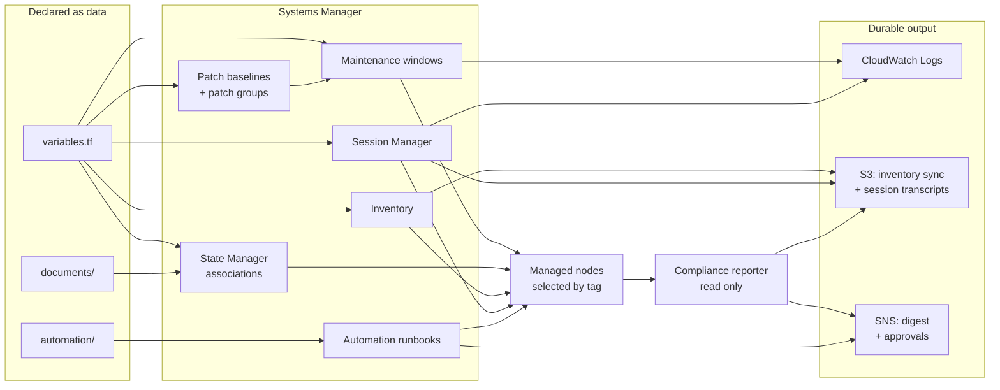
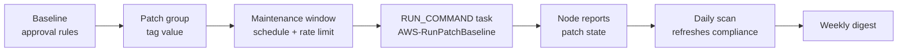

# aws-ssm-fleet-automation

Fleet operations for EC2 and hybrid managed nodes built on AWS Systems Manager, shipped
as Terraform. Patching, configuration convergence, inventory, and interactive access are
described as data and applied consistently across every node in the fleet.

## Architecture at a glance



Configuration is declared once and applied to whichever nodes carry the right tags. Every
capability writes somewhere durable, and nothing that reports is allowed to change a node.
See [docs/architecture.md](docs/architecture.md) for the component-by-component walkthrough.

## Capabilities

| Capability | What it does |
|---|---|
| Patch management | Patch baselines with explicit approval rules, patch groups, and rate-limited maintenance windows that run the patch operation on a schedule |
| Configuration convergence | State Manager associations that keep agents, packages, and settings at their declared state |
| Inventory and compliance | Systems Manager Inventory with a resource data sync so fleet state is queryable outside the console |
| Interactive access | Session Manager with hardened, audited logging in place of inbound SSH and bastion hosts |
| Operational runbooks | Automation documents for the work that does not fit a schedule: out-of-window patching, node diagnostics, adopting the hardening baseline |

Every capability is described as data and reuses the same tagging model, so a node joins
or leaves the fleet by how it is tagged rather than by an edit to this configuration.

## How nodes are selected

Everything is tag driven. A managed node joins a patch baseline by carrying the
`Patch Group` tag, and joins a maintenance window because that window targets the same
tag value. No instance IDs appear anywhere in this configuration, so a node scales in or
out of the fleet purely by how it is tagged.

```hcl
# Tag applied to the instance (or its launch template) elsewhere in your estate.
tags = {
  "Patch Group" = "linux-production"
}
```

## Patch flow

A patch reaches a node through four decisions, each owned by a different resource. Keeping
them separate means the risk appetite for a patch lives in one place and the blast radius
lives in another, so changing the schedule never changes what gets installed.



| Decision | Owned by | Shipped default |
|---|---|---|
| Which patches are acceptable | Baseline approval rules | Security and critical fixes approved after 7 days, bug fixes after 21 |
| Which nodes a baseline covers | `patch_groups` on the baseline, matched by the node's `Patch Group` tag | Four groups across Linux and Windows, production and non-production |
| When the work runs | `maintenance_windows` | Three weekly windows, non-production Sunday and production Saturday, all UTC |
| How fast it may sweep | `max_concurrency` and `max_errors` | 25% for non-production, 10% with a 2% error budget for production |

A baseline marked `set_as_default` covers nodes that carry no patch group tag at all, so an
untagged node is still measured against a baseline somebody reviewed rather than the
AWS-managed one. Window tasks run with `cutoff_behavior = CANCEL_TASK`: work that has not
started by the cutoff does not start, rather than running past the agreed window.

Operating the cycle, including triage when a node does not come back clean, is written up
in the [patch runbook](docs/patch-runbook.md).

## Repository layout

| Path | Purpose |
|---|---|
| `versions.tf` | Terraform and provider version constraints |
| `providers.tf` | Regional provider with default tags |
| `variables.tf` | Fleet configuration surface: baselines, windows, retention, roles |
| `patch-baselines.tf` | Patch baselines, patch groups, maintenance windows and their tasks |
| `state-manager.tf` | Published Command documents and the State Manager associations that run them |
| `documents/` | Run Command documents published to Systems Manager, one per file |
| `inventory.tf` | Inventory collection, the hardened sync destination, and the resource data sync |
| `compliance.tf` | Read-only compliance reporter, its notification topic, and its schedule |
| `lambda/compliance-reporter/` | Function that turns compliance state into a digest |
| `session-manager.tf` | Session preferences, the hardened transcript bucket and log group, and the operator policy |
| `automation.tf` | Published Automation runbooks and the role that runs them |
| `automation/` | Automation runbooks published to Systems Manager, one per file |
| `outputs.tf` | Identifiers other configurations and runbooks consume |
| `tests/` | Offline schema, control-flow, and contract checks for every published document |
| `docs/` | Architecture walkthrough and the patch runbook |
| `Makefile` | Entry points for deploy, patch reporting, linting, and tests |
| `.github/workflows/ci.yml` | Terraform validation and document schema lint on every change |

## Configuration convergence

A maintenance window patches the fleet on a cadence. An association does something
different: it keeps re-asserting a declared state, and reports a node that has drifted away
from it as non-compliant. Both are described the same way — a document, a tag-selected
slice of the fleet, a schedule, and a rate limit.

Every `*.yml` file in [`documents/`](documents/) is published as a Command document
automatically, so a new one is added to the fleet by adding a file. Associations reference
either a published document (`local_document`) or an AWS-managed one (`document_name`).

| Association | Document | Cadence | Effect |
|---|---|---|---|
| `agent-update` | `AWS-UpdateSSMAgent` | Every 14 days | Keeps the agent current so every other capability keeps working |
| `patch-scan` | `AWS-RunPatchBaseline` | Daily | Reports patch compliance between install windows without changing the node |
| `service-convergence` | `service-convergence` | Hourly | Holds the agent services at enabled and running |
| `fleet-diagnostics` | `fleet-diagnostics` | Twice daily | Surfaces a host low on disk or memory as non-compliant |
| `host-hardening` | `host-hardening` | Weekly, **off by default** | Converges hosts onto the ssh and SMB hardening baseline |

An association carrying `enabled = false` stays described in configuration but is not
created. That is how a document which rewrites host configuration ships ready to adopt
rather than switched on — review the values, flip the flag, and apply.

```hcl
state_manager_associations = {
  host-hardening = {
    local_document              = "host-hardening"
    schedule_expression         = "cron(0 5 ? * SUN *)"
    apply_only_at_cron_interval = true
    max_concurrency             = "5%"
    max_errors                  = "1"
    enabled                     = true

    targets = [
      {
        key    = "tag:Patch Group"
        values = ["linux-non-production"]
      },
    ]
  }
}
```

Systems Manager truncates the output it returns inline. Set `association_output_s3_bucket`
to an existing bucket to keep the full log of every run.

## Inventory and compliance

Patching and convergence act on the fleet. Inventory answers the prior question — what is
actually running out there — and compliance answers the operational one: which nodes are
currently out of line, on what, and how badly.

### Collection

One inventory association covers the fleet. Systems Manager permits exactly one per
managed node, so it is declared separately from the convergence associations rather than
as another entry alongside them. Categories are configured as booleans:

```hcl
inventory_collection = {
  applications                  = true
  instance_detailed_information = true
  network_config                = true
  services                      = true
  billing_info                  = false

  # File and registry collection are JSON documents, not flags. Left unset, neither is
  # collected — they are the categories that grow inventory volume fastest.
  files = jsonencode([{ Path = "/etc", Pattern = ["*.conf"], Recursive = false }])
}
```

### Where the data goes

Systems Manager keeps inventory for a limited window, which is long enough to answer a
question and too short to see a trend. The resource data sync copies inventory and
compliance data into S3 continuously, so fleet history survives and can be read with
ordinary data tools rather than through the API.

The destination bucket is created and hardened here unless `inventory_sync_bucket_name`
points at an existing one: object ownership enforced, public access blocked, versioning
on, encrypted with a rotating customer managed key, TLS required, and lifecycle expiry at
`inventory_retention_days`. The bucket policy grants Systems Manager exactly the write it
needs — scoped to the sync prefix and to this account's partition of it, nothing wider.

### The compliance digest

| | |
|---|---|
| What it reports | Fleet-wide compliant and non-compliant counts per compliance type, then the specific nodes failing at the severities you asked for |
| How it is delivered | A JSON report object under a date partition, plus a truncated digest published to a topic |
| How often | `compliance_report_schedule_expression`, weekly by default |
| What it changes | Nothing |

The reporter is read only by construction. It lists compliance state, writes its own
report object, and publishes a message — it never remediates a node, retriggers an
association, or changes a baseline. Remediation stays a deliberate act: a maintenance
window that installs patches, or an association switched on after review.

```hcl
compliance_report_severities        = ["CRITICAL", "HIGH"]
compliance_notification_emails      = ["platform-oncall@example.invalid"]
compliance_max_resources_in_summary = 25
```

Findings are ordered worst-first — severity, then how many items are failing — and the
published message is capped so a bad week does not produce an unreadable email. The full
set always stays in the report object.

## Interactive access

Session Manager exists here to make inbound SSH unnecessary: no bastion, no open port 22,
no long-lived key material on a node. What replaces them is a session that is
authenticated, authorised by tag, encrypted, and recorded.

Session preferences are account-and-region wide — Systems Manager reads the document named
`SSM-SessionManagerRunShell` for every session started in the region — so publishing them
is what makes logging non-optional for anyone who connects. Set
`enable_session_manager = false` where another configuration already owns that document.

### Where a session is recorded

| Destination | What it is for |
|---|---|
| S3 transcript bucket | The archive. Versioned, encrypted, TLS-only, lifecycle expiry at `session_log_retention_days` |
| CloudWatch log group | The live view. Streamed as the session happens, encrypted with the same key |

Both are on. They answer different questions: the log group is where a session in progress
is watched, the bucket is where a session from six months ago is read back. The bucket is
created and hardened here unless `session_log_bucket_name` points at an existing one.

### Who may connect to what

Access is granted by tag, never by instance ID. The operator policy permits
`ssm:StartSession` only to nodes carrying `session_access_tag_key` with a value matching
`session_access_tag_values`, and only through the reviewed preferences document.

```hcl
session_access_tag_key       = "Patch Group"
session_access_tag_values    = ["linux-non-production"]
session_idle_timeout_minutes = 20
session_max_duration_minutes = 60
session_key_user_role_arns   = ["arn:aws:iam::123456789012:role/fleet-node"]
```

Port forwarding is denied by default. Traffic through a forwarded port never reaches the
transcript, which defeats the audit trail the rest of this configuration builds — set
`allow_session_port_forwarding = true` where that trade-off has been accepted.

Both ends of an encrypted session need to use the session key: the node's instance role to
encrypt what it writes, the operator's role to decrypt what it reads. Roles listed in
`session_key_user_role_arns` are granted that use through the key policy.

## Operational runbooks

Some work does not fit a schedule. A patch that cannot wait for the next window, a node
that stopped converging, the hardening baseline that ships switched off and is adopted once
somebody has decided to. Writing those down as Automation documents rather than as shell
history is what makes them reviewable, repeatable, and runnable by somebody who was not
there the first time.

Every `*.yml` file in [`automation/`](automation/) is published as an Automation document,
so a runbook is added by adding a file.

| Runbook | What it does | Changes state | Approval |
|---|---|---|---|
| `patch-on-demand` | Scans a slice, pauses for approval, installs, re-reports patch state | Yes | Default on, can be waived |
| `collect-node-diagnostics` | Confirms a node is reachable and returns its diagnostics inline | No | Not applicable |
| `apply-hardening-baseline` | Snapshots a slice, gets approval, applies hardening, verifies nodes still answer | Yes | Mandatory |

```bash
aws ssm start-automation-execution \
  --document-name "fleet-patch-on-demand" \
  --parameters '{
    "TargetTagValue": ["linux-non-production"],
    "AutomationAssumeRole": ["arn:aws:iam::123456789012:role/fleet-automation"],
    "ApprovalTopicArn": ["arn:aws:sns:us-east-1:123456789012:fleet-change-approvals"],
    "Approvers": ["arn:aws:iam::123456789012:role/platform-oncall"]
  }'
```

The role the runbooks assume is created here and is deliberately narrow: commands may only
be sent to nodes carrying the patch-group tag, and only through this fleet's own documents
or the AWS patch document, so a runbook cannot be edited into a general-purpose remote
shell.

## Getting started

```bash
make init
make plan
make deploy
```

The shipped defaults create Amazon Linux 2 and Windows baselines, four patch groups, and
three weekly maintenance windows. Override `patch_baselines` and `maintenance_windows` to
describe your own fleet.

Once applied, `make patch-report` prints current patch compliance per patch group, and
`make compliance-report` invokes the read-only reporter on demand rather than waiting for
its schedule. `make help` lists every target.

```hcl
module "fleet" {
  source = "github.com/<your-github-org>/aws-ssm-fleet-automation?ref=v1.0.0"

  aws_region  = "us-east-1"
  name_prefix = "platform"

  maintenance_windows = {
    linux-production = {
      patch_group     = "linux-production"
      schedule        = "cron(0 3 ? * SAT *)"
      duration        = 4
      cutoff          = 1
      operation       = "Install"
      max_concurrency = "10%"
      max_errors      = "2%"
    }
  }
}
```

## Prerequisites

- The SSM Agent installed and running on every managed node.
- An instance profile granting the node `AmazonSSMManagedInstanceCore`.
- Network reachability to the Systems Manager endpoints, either through a NAT path or
  through interface VPC endpoints for `ssm`, `ssmmessages`, and `ec2messages`.

## Validation

Documents are published verbatim, so a defect in one ships as written. Everything that can
be checked without an account is checked before it can merge.

```bash
make lint       # terraform fmt + tflint, document and workflow YAML
make test       # document schema, control flow, cross-document contracts, script syntax
make validate   # terraform fmt, init without a backend, validate
make ci         # everything the pipeline runs, in pipeline order
```

The test suite reads documents from the working tree with the same glob Terraform uses, so
a new document is covered the moment the file exists. It enforces the schema Systems
Manager accepts, walks every runbook's control flow so a branch cannot point at a step that
does not exist, resolves each runbook's document references and parameter values against
the document that will receive them, and parses every rendered shell body. See
[tests/README.md](tests/README.md) for the full list and its known limitations.

`.github/workflows/ci.yml` runs the same gates on every push and pull request, with all
action references pinned to commit SHAs.

## Documentation

| Document | Covers |
|---|---|
| [docs/architecture.md](docs/architecture.md) | Component model, how each capability is built, and the design decisions behind them |
| [docs/patch-runbook.md](docs/patch-runbook.md) | Operating the patch cycle: routine checks, triage, policy changes, adopting the hardening baseline |
| [documents/README.md](documents/README.md) | Conventions every published Command document follows |
| [automation/README.md](automation/README.md) | The runbook catalogue |
| [tests/README.md](tests/README.md) | What the offline suite enforces |

## Design principles

- **Tag driven, never instance driven.** Fleet membership is a tag, so the configuration
  never needs to change when the fleet does.
- **Approval rules over blanket auto-approval.** Patches age for a defined period and are
  filtered by classification and severity before they are approved.
- **Rate limited by default.** Every window carries a concurrency ceiling and an error
  budget so a bad patch stops rather than sweeps the fleet.
- **Auditable output.** Patch command output is captured to CloudWatch Logs with an
  explicit retention period and optional customer managed encryption.
- **Idempotent convergence.** A document run against a node already in the declared state
  makes no change and succeeds, so a short association interval is safe. A node that did
  not converge exits non-zero and shows up as non-compliant.
- **Reporting never remediates.** The compliance reporter only reads state and publishes
  it. Anything that changes a node is an explicit, reviewable action elsewhere in this
  configuration.
- **Access is recorded, not trusted.** Interactive access is authorised by tag, bounded by
  an idle and a maximum duration, encrypted, and written to an archive the operator can
  read but cannot rewrite.
- **Change passes through approval.** A runbook that rewrites host configuration captures
  the state before, waits for an approver, and verifies the fleet afterwards. It expires
  rather than proceeding when nobody approves.
- **Templates, not device operations.** This repository ships infrastructure as code with
  placeholder values; it is never executed against a live account from here.

## License

MIT — see [LICENSE](LICENSE).
