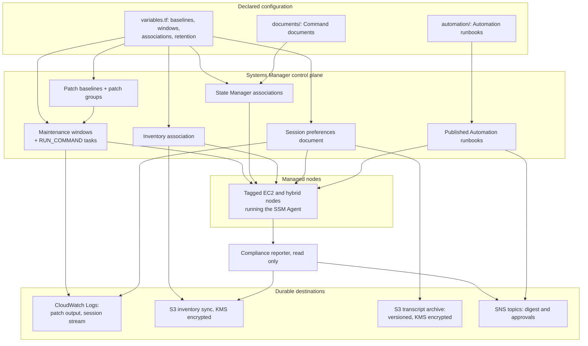

# Architecture

How the pieces of this configuration fit together, why each one is shaped the way it is,
and which decisions were deliberate enough to be worth writing down.

## The shape of the problem

Fleet management is usually approached as a list of machines: this instance needs patching,
that one drifted, this other one needs a shell. That approach stops working the moment the
fleet is elastic, because the list is stale as soon as it is written.

Everything here is built the other way round. A managed node is never named. It carries
tags, and every capability selects nodes by tag: a baseline applies to a patch group, a
maintenance window targets that same group, an association targets a tag expression, and
interactive access is authorised against a tag. A node scales in and is immediately in
scope; it scales out and disappears from scope. No configuration changes either way.

## Component model

## The five capabilities

### Patching

Three resources, three separate decisions, deliberately not merged:

| Resource | Decides |
|---|---|
| `aws_ssm_patch_baseline` | **Which** patches are acceptable: classification, severity, and how long a patch must age before it is approved |
| `aws_ssm_patch_group` | **Who** a baseline applies to: a tag value, not a node list |
| `aws_ssm_maintenance_window` | **When** the work happens, and how fast it is allowed to sweep |

Keeping them separate means the risk appetite for a patch is expressed once, in the
baseline, and the blast radius is expressed once, in the window. Changing the schedule
never changes what gets installed, and tightening an approval rule never changes when.

A baseline may be marked `set_as_default` for its operating system. That matters for nodes
which have not been given a patch group tag: without a default they would be evaluated
against the AWS-managed baseline, which nobody in the account has reviewed. Setting the
default means an untagged node is still measured against a baseline that was.

The window task runs `AWS-RunPatchBaseline` with `cutoff_behavior = CANCEL_TASK`, so work
that has not started by the cutoff does not start at all rather than running past the end
of the agreed window.

### Configuration convergence

A maintenance window is periodic work. An association is a standing assertion: this is the
state, keep re-establishing it, and report a node that has moved away from it.

Command documents are published from files. `state-manager.tf` discovers every `*.yml`
under `documents/` with a `fileset` and publishes each one, so a document is added to the
fleet by adding a file. There is no registration step to forget, and the test suite picks
the new document up with the same glob.

Each document carries both an `aws:runShellScript` step and an `aws:runPowerShellScript`
step, each guarded by a `platformType` precondition. A tag-selected association cannot tell
Linux nodes from Windows nodes, so a document that only handled one platform would fail on
half the fleet. The precondition lets one association cover both.

Exit status carries meaning. A document that could not converge a node exits non-zero, so
the node shows up as non-compliant instead of quietly reporting success. That is why the
diagnostics document deliberately fails a host that is over its utilisation threshold.

### Inventory and compliance

Systems Manager permits exactly one inventory association per managed node, so inventory is
declared on its own rather than as another entry in the association map. The collection
surface is modelled as booleans and converted once into the document's `Enabled` and
`Disabled` strings; file and registry collection are JSON documents rather than flags and
are merged in only when declared, so the rendered parameter set stays minimal.

Inventory data in Systems Manager itself has a limited window, long enough to answer a
question and too short to see a trend. The resource data sync copies inventory and
compliance data into S3 continuously so history survives, and the bucket policy grants
Systems Manager exactly the write it needs: `s3:GetBucketAcl` on the bucket and
`s3:PutObject` scoped to `<prefix>/*/accountid=<account>/*`, nothing wider.

The compliance reporter is a separate, read-only function. It paginates compliance
summaries, filters to the severities worth acting on, sorts worst-first, writes a
date-partitioned report object, and publishes a truncated digest.

### Interactive access

Session Manager is here to make inbound SSH unnecessary: no bastion, no open port 22, no
long-lived key material.

Session preferences are account-and-region wide. Systems Manager reads the document named
`SSM-SessionManagerRunShell` for **every** session started in the region, which is exactly
what makes logging non-optional: an operator cannot opt out of recording by starting the
session differently. `enable_session_manager` exists so a region whose preferences are
owned by another configuration is not fought over.

Both destinations are on because they answer different questions. The CloudWatch stream is
where a session in progress is watched; the versioned S3 archive is where a session from
six months ago is read back. The transcript bucket is versioned specifically because a
transcript is an audit artefact, so an overwrite must leave the original recoverable.

Authorisation is by tag and is narrowed twice more: `ssm:SessionDocumentAccessCheck` is
required, and port-forwarding documents are denied unless explicitly permitted, because
traffic through a forwarded port never reaches the transcript.

### Operational runbooks

Some work does not fit a schedule: a patch that cannot wait, a node that stopped
converging, a hardening baseline being adopted for the first time. Writing those down as
Automation documents rather than as shell history makes them reviewable, repeatable, and
runnable by somebody who was not there the first time.

Runbooks are published from `automation/*.yml` by the same fileset pattern the Command
documents use. The role they assume is deliberately narrow: `ssm:SendCommand` only to nodes
carrying the patch-group tag, and only through this fleet's own documents or the AWS patch
document, so a runbook cannot be edited into a general-purpose remote shell.

## Design decisions

**Tags select nodes; nothing else does.** No instance ID appears in this configuration.
The cost is that a mistagged node is out of scope silently; the benefit is that the
configuration never has to change when the fleet does. Drift reporting in the compliance
digest is what covers the cost.

**Rate limits are mandatory, not optional.** Every fleet-wide command, whether a window
task, an association, or a runbook step, carries a concurrency ceiling and an error budget.
An unbounded command against a tag-selected fleet is indistinguishable from an outage.

**Reporting never remediates.** The compliance reporter reads state and publishes it. It
cannot patch, retrigger an association, or edit a baseline. Anything that changes a node is
an explicit act elsewhere: a maintenance window, or an association switched on after
review.

**A configuration-rewriting document ships switched off.** `host-hardening` is fully
described and its association carries `enabled = false`, so it is reviewable before it is
live. The `described_associations_not_created` output makes the fact that something is
described but inert visible rather than buried.

**Change that alters hosts passes through approval.** The hardening runbook takes a
snapshot, waits for a named approver, applies, and then verifies the slice still answers,
so a node that hardened itself out of reach surfaces in the run that did it rather than a
week later.

**Validate before adopting.** The sshd convergence path writes to a temporary copy, runs
`sshd -t` against it, and only then replaces the live file, keeping a timestamped backup
and reloading rather than restarting so established sessions survive.

**Encryption keys are per concern.** Inventory and session data use separate customer
managed keys with rotation on, rather than one shared key. Compromise or revocation of one
does not reach the other, and each key policy can be scoped tightly: the session key grants
use to both ends of a session, which the inventory key never needs.

**Templates, never device operations.** This repository ships infrastructure as code with
placeholder values. It is not executed against a live account from within the repository.

## Where to look next

- [Patch runbook](patch-runbook.md) for operating the patch cycle and what to do when it
  goes wrong.
- [Command documents](../documents/README.md) for the conventions every published document
  follows.
- [Automation runbooks](../automation/README.md) for the runbook catalogue.
- [Tests](../tests/README.md) for what is enforced before a document can ship.
