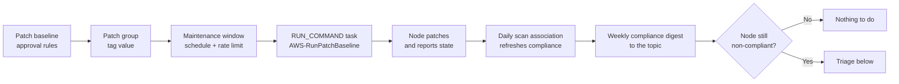

# Patch runbook

Operating the patch cycle: what runs on its own, what to check, and what to do when a node
does not come back clean.

All examples use placeholder identifiers. Substitute your own region, account, and tag
values.

## Before you start

| Need | Why |
|---|---|
| AWS CLI v2, authenticated to the fleet account and region | Every command below is a Systems Manager call |
| `terraform output` from an applied configuration | Window, baseline, and document names are derived from `name_prefix` |
| A managed node carrying the `Patch Group` tag | Baseline association is by tag; an untagged node falls back to the default baseline |

```bash
export AWS_REGION="us-east-1"
terraform output -json > outputs.json
```

## The cycle



A patch reaches a node through four decisions, each owned by a different resource. Knowing
which one to look at is most of triage.

| Decision | Owned by | Change it when |
|---|---|---|
| Is this patch acceptable? | Baseline approval rules | A classification or severity is in or out of scope, or the ageing period is wrong |
| Does this node get that baseline? | Patch group tag on the node | A node is in the wrong risk tier |
| When does the work run? | Maintenance window schedule | The window collides with business hours or another change |
| How fast may it sweep? | `max_concurrency` and `max_errors` | A bad patch needs to stop sooner, or the window is too slow to finish |

## What runs without you

| Cadence | What happens |
|---|---|
| Daily | The `patch-scan` association runs `AWS-RunPatchBaseline` with `Operation=Scan` and `NoReboot`, refreshing compliance without touching the node |
| Every 14 days | The `agent-update` association keeps the SSM Agent current, which every other capability depends on |
| Weekly, per window | Each maintenance window runs its patch task against its patch group, rate limited |
| Weekly | The compliance reporter publishes a worst-first digest to the notification topic and writes the full report to S3 |

The shipped windows are: non-production Linux Sunday 02:00 at 25% concurrency, production
Linux Saturday 03:00 at 10% with a 2% error budget, and production Windows Saturday 04:00
on the same limits. All times are UTC.

## Routine checks

### Is the fleet compliant?

```bash
aws ssm list-compliance-summaries \
  --filters "Key=ComplianceType,Values=Patch,Type=EQUAL"
```

### Which nodes in a patch group are behind?

```bash
aws ssm describe-instance-patch-states-for-patch-group \
  --patch-group "linux-production" \
  --query "InstancePatchStates[?MissingCount>\`0\`].[InstanceId,MissingCount,FailedCount,OperationEndTime]" \
  --output table
```

### What did the last window actually do?

```bash
WINDOW_ID=$(terraform output -json maintenance_window_ids | jq -r '."linux-production"')

aws ssm describe-maintenance-window-executions \
  --window-id "$WINDOW_ID" \
  --max-results 5 \
  --query "WindowExecutions[].[WindowExecutionId,Status,StartTime,EndTime]" \
  --output table
```

Take a `WindowExecutionId` from that list to see the task and its per-node invocations:

```bash
aws ssm describe-maintenance-window-execution-task-invocations \
  --window-execution-id "<window-execution-id>" \
  --task-id "<task-id>"
```

Full command output is in the patch log group, which is `terraform output -raw
patch_log_group_name`.

## Triage

### A node reports missing patches after a window ran

Work down this list; the first mismatch is usually the answer.

1. **Is the node in the window's patch group?** The window targets `tag:Patch Group`. A
   node with no tag, or a different value, was never in scope.

   ```bash
   aws ssm describe-instance-patch-states --instance-ids "<instance-id>" \
     --query "InstancePatchStates[].[PatchGroup,BaselineId,Operation,OperationEndTime]" \
     --output table
   ```

2. **Did the baseline approve the patch?** A patch inside its ageing period is correctly
   reported as missing but not yet approved.

   ```bash
   aws ssm describe-instance-patches --instance-id "<instance-id>" \
     --filters "Key=State,Values=Missing" \
     --query "Patches[].[Title,Classification,Severity,State]" --output table
   ```

3. **Did the error budget stop the sweep?** If `max_errors` was reached, later nodes were
   never attempted. The window execution status shows `FAILED` with fewer invocations than
   the group has members.

4. **Was the cutoff hit?** `cutoff_behavior = CANCEL_TASK` means work that had not started
   by the cutoff did not start. A window that is consistently cut short needs a longer
   `duration` or a higher `max_concurrency`.

5. **Is the node actually reachable?** An offline node queues a command rather than failing
   it, which looks like a hang.

   ```bash
   aws ssm describe-instance-information \
     --filters "Key=InstanceIds,Values=<instance-id>" \
     --query "InstanceInformationList[].[PingStatus,AgentVersion,PlatformName]" --output table
   ```

### A node needs patching before its next window

Use the on-demand runbook rather than a bare `send-command`: it scans first, pauses for
approval, installs, and re-reports state.

```bash
aws ssm start-automation-execution \
  --document-name "fleet-patch-on-demand" \
  --parameters '{
    "TargetTagValue": ["linux-non-production"],
    "AutomationAssumeRole": ["arn:aws:iam::123456789012:role/fleet-automation"],
    "ApprovalTopicArn": ["arn:aws:sns:us-east-1:123456789012:fleet-change-approvals"],
    "Approvers": ["arn:aws:iam::123456789012:role/platform-oncall"]
  }'
```

Watch it, and approve when the wait step is reached:

```bash
aws ssm describe-automation-executions \
  --filters "Key=DocumentNamePrefix,Values=fleet-patch-on-demand" \
  --query "AutomationExecutionMetadataList[0].[AutomationExecutionId,AutomationExecutionStatus]" \
  --output text
```

`RequireApproval` can be set to `false` for a genuine emergency. Doing so removes the only
human gate in the path, so it belongs in an incident record.

### A node is unreachable or behaving oddly

Collect diagnostics before changing anything. This runbook is read only.

```bash
aws ssm start-automation-execution \
  --document-name "fleet-collect-node-diagnostics" \
  --parameters '{
    "InstanceId": ["i-0123456789abcdef0"],
    "AutomationAssumeRole": ["arn:aws:iam::123456789012:role/fleet-automation"]
  }'
```

It asserts the node is `Online` before running, so an offline node returns a clear failure
instead of a queued command that appears to hang.

### A patch broke something

1. **Stop the sweep.** Cancel the in-flight command so remaining nodes are not touched.

   ```bash
   aws ssm cancel-command --command-id "<command-id>"
   ```

2. **Reject the patch in the baseline.** Add it to `rejected_patches` for the affected
   baseline and apply. `rejected_patches_action = "BLOCK"` refuses the patch and anything
   that depends on it; `ALLOW_AS_DEPENDENCY` installs it only when another approved patch
   requires it.

3. **Confirm the rejection took effect** before the next window:

   ```bash
   BASELINE_ID=$(terraform output -json patch_baseline_ids | jq -r '."amazon-linux"')
   aws ssm get-patch-baseline --baseline-id "$BASELINE_ID" \
     --query "[RejectedPatches,RejectedPatchesAction]"
   ```

4. **Roll the node back** by whatever mechanism your image pipeline provides. This
   configuration does not uninstall patches, deliberately: an automated uninstall is a
   larger blast radius than the problem it is trying to fix.

## Changing the patch policy

| Change | Where | Takes effect |
|---|---|---|
| Approve patches sooner or later | `approve_after_days` in the baseline's approval rules | Next scan |
| Add a classification or severity | `patch_filters` in an approval rule | Next scan |
| Refuse a specific patch | `rejected_patches` on the baseline | Next scan |
| Move a node between risk tiers | The node's `Patch Group` tag value | Immediately |
| Shift the window | `schedule` in `maintenance_windows` | Next occurrence |
| Change the sweep rate | `max_concurrency`, `max_errors` | Next occurrence |
| Stop rebooting during patching | `reboot_option = "NoReboot"` | Next occurrence |

Every one of these is a Terraform change. Apply it, then re-check the shipped defaults with
`make plan` before the window is due, so a policy edit is never first seen at 03:00.

## Adopting the hardening baseline

The `host-hardening` document ships fully described with its association switched off.
Adopting it is a decision, taken once, after review:

1. Read the document and confirm the ssh and SMB settings match your standard.
2. Run the runbook against a non-production slice first. It snapshots the slice, waits for
   an approver, applies, then verifies the nodes still answer.

   ```bash
   aws ssm start-automation-execution \
     --document-name "fleet-apply-hardening-baseline" \
     --parameters '{
       "TargetTagValue": ["linux-non-production"],
       "AutomationAssumeRole": ["arn:aws:iam::123456789012:role/fleet-automation"],
       "ApprovalTopicArn": ["arn:aws:sns:us-east-1:123456789012:fleet-change-approvals"],
       "Approvers": ["arn:aws:iam::123456789012:role/platform-oncall"]
     }'
   ```

3. Once the slice is proven, set `enabled = true` on the `host-hardening` association so
   the state is held rather than applied once.

The verification step exists because ssh hardening is the one change that can remove the
path used to fix it. If the slice stops answering, the run that did it reports the failure.

## Cadence summary

| When | Do this |
|---|---|
| Weekly, on the digest | Read the compliance digest; triage anything at CRITICAL or HIGH |
| After each window | Spot-check one window execution for cutoffs and error-budget stops |
| Monthly | Review approval rules against what is actually being deferred |
| On any patch-caused incident | Cancel, reject, confirm, record |
| Before any policy change | `make plan` and read the diff |
